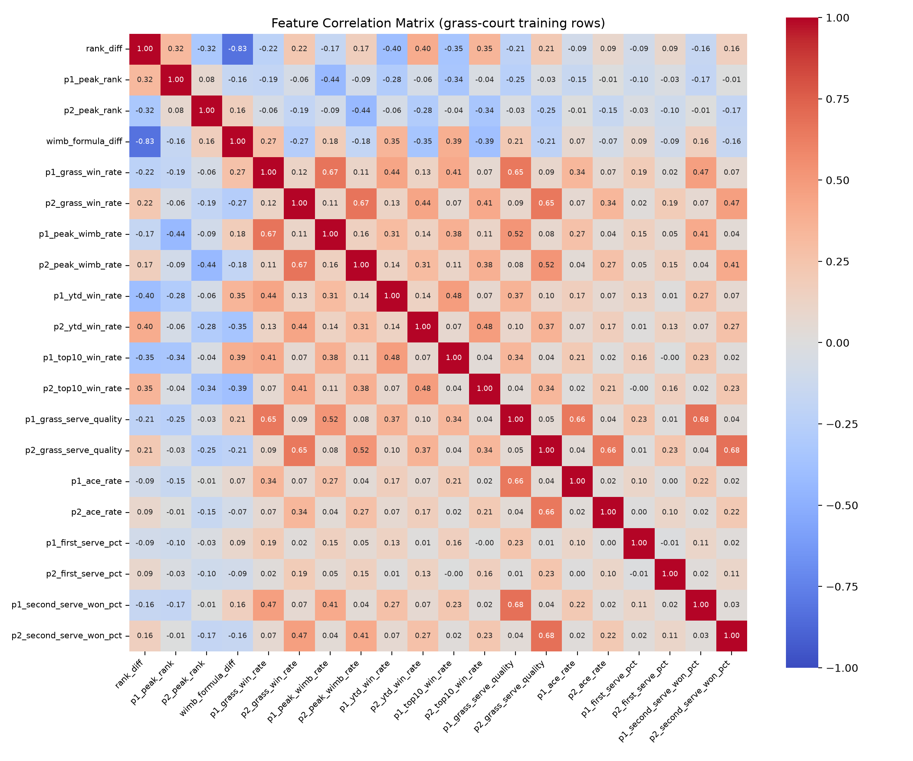

# Wimbledon 2026 — Random Forest Win Probability Model

This project predicts the winner of the 2026 Wimbledon gentlemen's singles draw with a random forest trained on ATP match data (2015–2026). These predictions are validated against both internal cross-validation and external devigged betting market odds. The tournament is simulated two ways: a pre-tournament Monte Carlo simulation (50,000 runs from the actual draw) in `wimbledon_rf.py`, and a live resimulation that shrinks the bracket to winners as actual results are announced, in `resimulate.py`.

**Result:** 5-fold cross-validated Brier score of **0.2022 ± 0.0026** (accuracy 67.8%), evaluated on 3,311 grass-court matches, using a leakage-free feature pipeline and match-grouped CV.

## Project structure

| File | Role |
|---|---|
| `wimbledon_rf.py` | Core pipeline: loads data, builds features, trains the model, runs the pre-tournament Monte Carlo simulation. |
| `fetch_data.py` | Pulls and prepares the raw ATP match data. |
| `odds_backtest.py` | Validates the model against external historical betting markets. |
| `resimulate.py` | Updates championship probabilities live as real 2026 results come in. |

## Data

- ATP match-level data 2015–2026 across all surfaces (via [tennisabstract.com](https://tennisabstract.com)), which amounts to 32,237 matches total. Grass matches are used to compute the grass-specific features (`grass_win_rate`, `grass_serve_quality`, `peak_wimb_rate`).
- Each match contributes two rows (winner-perspective, loser-perspective), giving 6,622 training rows.
- Features for a given match are built from `Player_Stats` state before `update_after_match` is called on that match, ensuring no lookahead leakage from the match being predicted.

## Model choice: why random forest?

Three properties of tennis-match data rule out a plain logistic regression and make a neural network impractical, while a random forest handles both:

- **Non-linearity.** Several features have diminishing or plateauing effects rather than linear ones; for example, the gap between a bad serve and a good serve matters more than the gap between a good serve and a great one. `ace_rate`, `grass_serve_quality`, and `peak_rank` all show this pattern.
- **Multicollinearity.** The win-rate features (`grass_win_rate`, `ytd_win_rate`, `top10_win_rate`, `peak_wimb_rate`) and the serve features (`grass_serve_quality`, `ace_rate`, `second_serve_won_pct`) are correlated by construction (r = 0.5–0.7 between related pairs; `rank_diff` and `wimb_formula_diff` are r = -0.83). A regression's coefficients would be unstable under this; a tree ensemble is unaffected. (Claude, I need you to use the image and talk about it in this bullet about multicollinearity)

- **Non-independence of observations.** A player's form and fatigue carry from match to match within a tournament, so the assumption behind standard regression inference doesn't hold cleanly here either.

A neural network would in principle handle the non-linearity too, but grass is the shortest ATP season by a wide margin (~10% of tour matches), so the effective sample size on the grass-specific features is too small to train. Furthermore, a neural network would lose interpretability that might be desired with these features.

### Hyperparameters

| Parameter | Value | Rationale |
|---|---|---|
| `n_estimators` | 1000 | More trees reduce the variance of the ensemble's averaged class-probability estimate. |
| `max_depth` | 15 | 19 features with paired (p1/p2) structure need enough depth to capture interaction effects between them. |
| `min_samples_leaf` | 25 | Regularizes against `max_depth=15` by requiring historical support behind every split. |
| `criterion` | `log_loss` | Penalizes confident wrong predictions more than Gini does, which matters because the output used downstream is the probability itself, not just the argmax class. |

## Features

| Feature | Description |
|---|---|
| `rank_diff` | Log-difference of ATP rank (1→50 is not equivalent to 50→100, so raw rank difference would be misleading). |
| `peak_rank` | Player's best-ever ATP ranking. |
| `grass_win_rate` | Career win rate restricted to grass-court matches. |
| `peak_wimb_rate` | Best single-year win rate the player has posted at Wimbledon itself. |
| `ytd_win_rate` | Win rate in the current season, as a form signal. |
| `top10_win_rate` | Win rate specifically against top-10 opponents — a proxy for upset/deep-run potential. |
| `ace_rate`, `first_serve_pct`, `second_serve_won_pct` | Serve statistics. |
| `grass_serve_quality` | % of service points won, grass-restricted. Currently doesn't account for serve speed. |
| `wimb_formula_diff` | Proxy for Wimbledon's former seeding formula (ATP rank blended with a grass-specific rating), reconstructed from rolling grass results to test whether it would still carry predictive value if reinstated. |

## Results

**5-fold GroupKFold cross-validation**, evaluated on the grass-court subset since that's the closest proxy to Wimbledon conditions (folds split on `match_id`, so a match's winner-row and loser-row never land in different folds). 5-fold was chosen to balance between compute cost and bias. The output of the model was as follows:

- Brier score: **0.2022 ± 0.0026**
- Accuracy: **67.8%**

**Feature importance** (p1/p2 pairs combined):

| Feature | Importance |
|---|---|
| `wimb_formula_diff` | 0.207 |
| `rank_diff` | 0.140 |
| `peak_rank` | 0.107 |
| `ytd_win_rate` | 0.082 |
| `ace_rate` | 0.074 |
| `grass_serve_quality` | 0.073 |
| `peak_wimb_rate` | 0.072 |
| `grass_win_rate` | 0.070 |
| `top10_win_rate` | 0.067 |
| `second_serve_won_pct` | 0.054 |
| `first_serve_pct` | 0.054 |

The reconstructed Wimbledon seeding formula and log rank-difference are the two strongest signals by a clear margin — a reasonable result, since both are themselves aggregations of a player's grass-specific track record.

**2026 championship probabilities** (50,000 tournament simulations from the actual draw, pre-tournament):

| Player | Win probability |
|---|---|
| Sinner | 30.1% |
| Zverev | 9.0% |
| Auger-Aliassime | 8.1% |
| Djokovic | 7.0% |
| Shelton | 6.6% |
| Fritz | 4.4% |
| De Minaur | 3.8% |
| *(remaining field ≥1%)* | — |

## Validating against the market (`odds_backtest.py`)

Because cross-validation only checks the model against itself, for trading it's necessary to check against market offs. `odds_backtest.py` backtests against devigged historical market odds to see 

- Historical Wimbledon odds are pulled from `data/odds/{year}.xlsx` and converted from decimal odds into a fair ("no-vig") probability, since raw odds imply a total probability above 100% once the bookmaker's margin is included.
- The model is trained once on data strictly before the earliest backtest year, then walked forward chronologically match-by-match, so at every prediction point no leakage occurs.
- Both the model and the market are scored with log-loss, and the two scores are compared directly.

This matters more than the cross-validation testing because beating the market allows for profit to be made. An important caveat that will need to be included in future projects is beating both the market and the fee, and prediction markets run by Kalshi and Polymarket have fees that could render trades unprofitable.

## Live tournament updating (`resimulate.py`)

`wimbledon_rf.py` generates a single static snapshot using information prior to the tournament. In order to have a more usefule model for trading live as the tournament progresses, `resimulate.py` allows for a dynamic bracket that removes the losers and updates using the winners of each given round. The fitted model itself is untouched, so no retraining happens since refitting a 1000-tree forest on a handful of new match rows would lead to overfitting.

State (who's eliminated, match log so far) is persisted to `data/tournament_state.json`, so the script only needs each round's new results, not the full history each time.

## Limitations

- **No time-decay on historical rates.** `grass_win_rate`, `top10_win_rate`, etc. are unweighted career rates — a win from 2015 counts identically to one from last month, despite tennis form and injury cycles moving faster than that. This will be added in future tournament predictions.
- **Uncalibrated probabilities.** Random forests are known to compress probabilities toward 0.5 relative to true frequencies, particularly with a smoothing parameter like `min_samples_leaf=25`. No calibration layer or reliability check has been applied yet, so these probabilities are better trusted as a ranking of players as opposed to frequencies.
- **Missing shot-level data.** Granular data like serve speed, rally shot placement, and forehand/backhand pace isn't available yet at the resolution needed for this project, but is being generated for future versions.
- **Random-fold rather than time-respecting validation for the headline CV number.** GroupKFold prevents leakage within a match but still shuffles matches across years into folds, so that score can be modestly optimistic relative to the walk-forward evaluation `odds_backtest.py` performs.

## Going forward

- Adding probability calibration and report a reliability diagram before/after.
- Adding a logistic regression baseline and a gradient-boosted tree (XGBoost/LightGBM) comparison to substantiate the random forest choice with evidence rather than assertion.
- Extending `resimulate.py` into an actual trading signal against Kalshi and/or sportsbook markets, sizing positions off the model-vs-market edge rather than just reporting probabilities. From this, I'd want to see which trades succeed and fail, and train a model based off that new knowledge.

## Acknowledgments

Data generated by [tennisabstract.com](https://tennisabstract.com).
